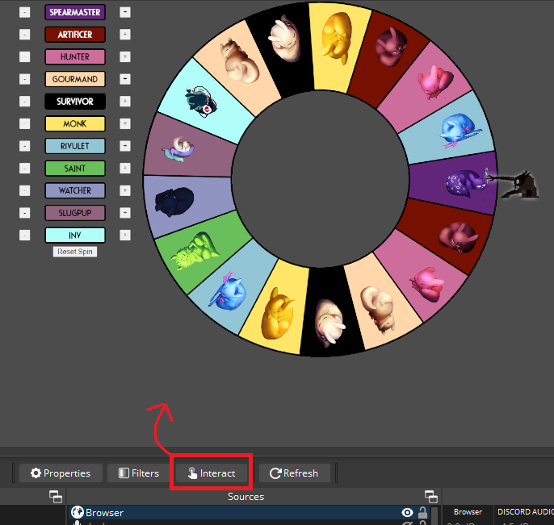

Libraries used:
[Winwheel](https://github.com/zarocknz/javascript-winwheel)
[TweenMax, now GSAP](https://gsap.com/)
[Color.js](https://colorjs.io/docs/contrast)

Assets used (Images, Sfx) are from [Rain World](https://store.steampowered.com/app/312520/Rain_World/)

Font: [Rodondo](https://www.dafont.com/rodondo.font)

Created by [Dreki Ormur](https://bsky.app/profile/drekiormur.bsky.social)

How to use:

A. Simply open ScugWheel.html
B. OBS Browser source
 1. Create browser source
 
 2. Open `wheelConfig.js` with your text editor of choice to customize the default wheel that will spawn
  
 3. Edit the current wheel to remove/add segments as desired using the menu on the left. Browser source can be cropped by holding ALT when click-dragging the left side to hide the menu bar.
 4. With the Browser Source selected, click the `Interact` button to open up a window. 
 5. Click on the wheel to spin.
 6. Click the result to clear it, and press the `Reset Spin` button in the Menu to be able to spin the wheel again.
 